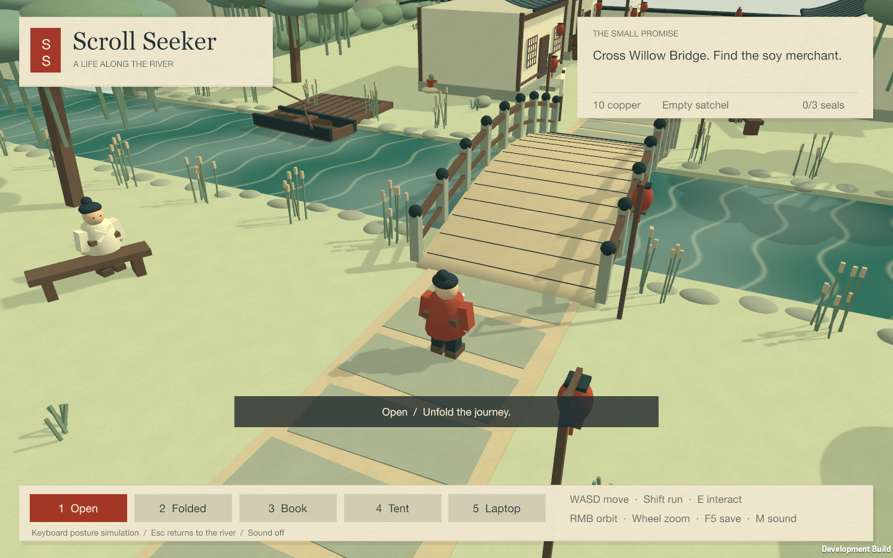

# 尋畫 Scroll Seeker

## Unity 3D riverside adventure

The independent [`Unity/`](Unity/README.md) project adds a playable third-person village: accept Mother’s errand, cross Willow Bridge, buy and fill soy sauce at Master Chen’s counter, then walk home and Fold to deliver. It includes camera orbit, collisions, procedural character animation, NPC dialogue, collectible ink seals, unique rewards, local saves and five desktop posture modes. The Swift/iOS project remains in `App/` with its original story and assets.

Use Unity **6000.3.25f1 (6.3 LTS), Apple Silicon**. Start with [controls, setup, architecture and tests](Unity/README.md); see [actual validation results](docs/UnityValidation.md), [environment and engine space requirements](docs/DevelopmentEnvironment.md), and [asset sources](Unity/ASSET_SOURCES.md). The Unity version implements desktop posture selection; physical fold hardware support is not implemented.

Actual macOS development-player capture. The [pouring challenge](docs/UnityScreenshots/pouring.png) and [earned shadow theater](docs/UnityScreenshots/theater.png) show the Laptop and Tent modes.

## Original Swift/iOS adventure

A story adventure across a supplied ink-painted world, inspired by the Qingming handscroll and built for iPhone and iPhone Duo: **打醬油 · A Life Along the River**.

## Play

- Begin as Xiao An, a child sent by Mother to buy soy sauce. Free Act I contains seven missions and the home hub, including folding a paper boat with a child at the stream between asking directions and helping the boatmen. The paper-boat quest awards five copper. Completing challenges—not merely reaching their locations—earns coins, items, and journal entries.
- At Rainbow Bridge, choose an adult future: Scholar or Gentleman Thief. Pro includes both five-mission Act II paths, their endings, story-earned Pro equipment, and additional outfits. Path and wardrobe access also respect story progression.
- Fold to return to the farmhouse, seal a letter to Mother, read her reply, check the current objective, browse inventory and journal, buy eligible gear with earned copper, or change clothes. Home shows Mother and child already painted at the doorway, without adding a duplicate figure. Letters themselves never award mission rewards.
- The sole world artwork is `App/Resources/World/world.jpg`, currently **9,832 × 724 pixels**, with six scenes: Home Village, Willow Path & Tea House, River Docks, Outer Market, City Gate, and the Capital. Gameplay renders the six supplied, exact-offset tiles from `World/tiles/tiles.json`, fully decoded off the main thread while Home is visible and retained in memory. Dimensions come from the supplied metadata, not a hardcoded panorama size. Begin in the right-hand countryside and journey left; tap the road or use directional controls to walk. Pinch from 1× to 4×, or up to 6× with the magnifier. Home, memories, future previews, and the shadow theater use this same artwork.
- The open world is full-bleed. Its right-anchored wooden roller reveals the already-rendered continuous map toward the left over about 1.5 seconds and reverses when closed. There are no band-shifted panorama copies. Reduce Motion makes the reveal immediate.
- Five mist bands join the scenes at normalized x **.188, .344, .500, .656, .812**. Xiao An briefly fades and moves a little faster through them. Folding and reopening always preserves his exact position; scenes change only as he walks through the mist, never by teleporting.
- On a fresh journey, the first complete reveal shows Xiao An walking a few steps out from Home before waiting with “按住左邊走路 · Hold left to walk.” This one-time introduction follows the same road and can be interrupted by player input. Every app launch begins in the Home hub while preserving the saved journey position.
- Each of the 17 quests has a unique red seal and a two-line Chinese poem with an English translation. Curated verses appear immediately; when Apple's local Foundation Model is available, an original couplet is generated and cached on-device. Unavailable models or invalid responses keep the curated verse. The Home hub's **印譜 · Seal album** shows earned stamps and empty slots; tap an earned stamp to revisit its saved poem. Pro-only slots lead to the existing paywall.
- Successful scenes bloom on the world painting before a unique seal stamps into the reward card with a gentle haptic. Existing historical colorizations appear **only in story/reward cards**, labeled “The scene come to life.” They never replace or overlay the world. [Prompts and asset provenance](docs/Colorization.md).

## Five discrete postures

Gameplay uses named posture changes, **not a continuous hinge angle**:

| Posture | Experience |
| --- | --- |
| Folded | A letter home, Mother's reply, the farmhouse hub, and the fold-only soy-sauce delivery when its prerequisites are met. |
| Book | At the fork, two facing pages reveal the Scholar and Thief futures. Elsewhere, compare childhood and adulthood at the same painting coordinates without moving the hero. Active missions can use their own posture challenge. |
| Open | Walk and play inside the full-height handscroll. |
| Tent | A two-sided shadow-puppet theater presents earned story scenes without revealing unearned endings. At the Capital, an optional local two-player cricket match awards five copper per completed round. Active mission challenges take precedence. |
| Laptop | The painting stays above a lower control desk, with contextual walking and mission controls. |

On iOS 27.1, the observer uses discrete hinge status and reserved fold-region orientation: closed maps to Folded, fully open to Open, and partially open to Book or Laptop. These signals do not reliably identify Tent; use the on-screen posture picker or contextual fallback buttons. Where hinge events are unavailable, a coarse size-change fallback distinguishes only Folded and Open. All five postures remain selectable for simulator use. This is not a claim that every physical orientation has been verified on hardware.

Controls have accessibility labels, and painting actions support zoom and pan. Path handles offer accessible nudge/delete actions. Reduce Motion simplifies reveals and scene animations. Gameplay pauses while covered by dialogs or other presentations and while the app is inactive. Optional synthesized paper and guqin-like sounds are in Settings; sound defaults off, respects Silent mode, and mixes with other audio. No microphone is used.

## Walking path and local editor

Xiao An's feet follow the **44-point `walkpath` in the latest `World/world.json`**, using a shared nonuniform Catmull–Rom spline in full-world normalized coordinates. Walking clamps to the traced endpoints, and the displayed editor curve uses the same interpolation as the model. Missions and home use the same document's named places; its source coordinates are not rewritten.

Hold the minimap for two seconds to open the path editor. Drag yellow handles, tap empty painting to add a point, or hold a handle to delete it; pan and pinch remain available. Copy JSON exports the draft as `{"note":"…","points":[[x,y],…]}`. Save orders points right-to-left and validates finite, normalized coordinates, distinct descending x values, and at least two points.

Saved edits are an on-device override, not a rewrite of the bundled JSON or a reset of story progress. Reset restores the draft from the currently saved path; closing without saving discards draft changes.

The six-scene world has its own versioned path-override namespace. Overrides from the historical panorama or earlier four-scene world are not applied to this different coordinate system. Existing story saves move Xiao An to the new Home once while preserving earned coins, gear, completed missions, titles, and letters. Subsequent launches resume normally.

## RevenueCat

The connected account's existing `pro` entitlement, `default` offering, and [published paywall](https://app.revenuecat.com/projects/34a58452/paywalls/pwc4af656faf734819/builder) are reused. **Published revision 6** describes the two adult paths, story-earned Pro gear, and additional outfits, with Act I and home free. Existing product identifiers and prices are preserved, as requested when a catalog already exists:

| Package | Existing USD price |
| --- | --- |
| Monthly | $3.99 |
| Yearly | $24.99 |
| Lifetime | $49.99 |

RevenueCat and RevenueCatUI remain pinned to 5.80.0: the connected SDK endpoint returned the complete published paywall for this version during verification. Debug/simulator builds use RevenueCat Test Store with real SDK entitlement checks, not a local Pro bypass. Test Store purchases do not charge money. Restore and Customer Center are available in Settings.

Locked paths and purchases use RevenueCat's `PaywallView`; earned copper is not an in-app purchase. Live App Store billing still requires App Store products/credentials and the public `appl_…` SDK key as `RevenueCatAPIKey` in Project.json. Release builds exclude the Test Store key and safely leave Act I and home available until live billing is configured. No secret keys belong in the app.

## Assets, storage, and verification

The supplied `World/world.jpg` and `World/world.json` define the current adventure; no additional world backgrounds were generated or downloaded for this migration. The former historical panorama tiles and route remain recoverable in the project but are excluded from the app bundle. Historical clue data and the previously requested colorizations remain for story cards only. The three previously generated transparent Xiao An sprites (child, scholar, and thief) remain in gameplay and character presentations. The shadow theater now also uses crops of the sole world painting behind its character silhouettes.

World position, mission progress, coins, inventory, gear, outfits, titles, journal entries, letters and Mother's replies, cricket rewards, path overrides, and sound preference persist locally. Existing Liubai journal data is left untouched. No microphone/speech permission is requested, and no CloudKit synchronization is implemented.

Native regression suites cover story progression, discrete postures and letters, walking-path persistence, cricket rewards, world-coordinate mapping, and viewport geometry. See [current commands, counts, and coverage](Tests/README.md); checks compile production models with Swift 6 and isolate persistence from player saves. App builds use Bitrig's build tool. These checks do not establish UI playability, physical posture behavior, presentation transitions, or purchase-flow coverage; those require separate simulator/device verification.

For a complete demo route, posture sequence, and current limitations, see [Demo walkthrough](docs/Demo.md).

Historical reference: Zhang Zeduan, Along the River During the Qingming Festival, Northern Song. Public domain. The current supplied world is a separate illustrated adventure setting, not the original historical panorama.
